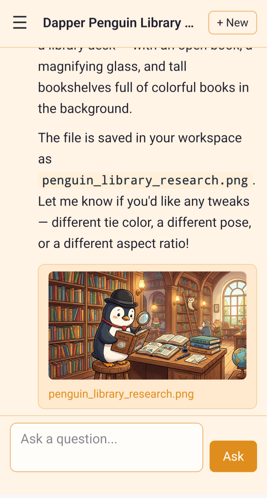

# Pengyplexity

**A Perplexity-style AI answer engine you can run yourself** — with web search as
the star, and every line of code the model writes executed inside a sandbox it
cannot escape.

Ask a question. The model searches the web, reads what it finds, and answers with
citations, streaming into the page as it goes. It can chart data, generate images,
and write a full research report you can download as a PDF. Self-hosted,
multi-user, and confined to a workspace of its own.

**The sandbox is not a feature of this app — it is the point of it.**

---

## Screenshot

Pengyplexity on a phone: a question answered with an image the agent generated
into that thread's own workspace — answer text, inline artifact and all, still
inside the sandbox.



---

## What it does

- **Answers with sources, not vibes** — web search runs first, and every answer
  carries its **Sources** as title + URL. The model can fetch a page and read it
  properly before committing to an answer.
- **Streams as it works** — token-by-token SSE plus live tool activity, so you
  watch the search happen instead of staring at a spinner.
- **Deep research on demand** — one question becomes several bounded searches,
  synthesised into a report you can read as HTML or download as PDF.
- **Charts and images** — ask for a chart and it writes and runs matplotlib code;
  ask for a picture and it generates one. Both land inline in the thread and in a
  per-user workspace gallery you can download as a ZIP.
- **A memory that persists** — the model can save and search private, per-user
  memories across conversations, with hybrid lexical + semantic search, and every
  edit is versioned rather than silently overwritten.
- **Multi-user, admin-managed** — real logins with **no self-sign-up**,
  per-user themes (3 modes × 8 accents), and an admin settings panel that changes
  most behaviour live, with no restart.
- **Share anything** — push an answer or an image straight to a shareable link.

---

## Safety, at a glance

Handing a language model a shell is normally a bad idea. Pengyplexity is built so
that it isn't: the safety is **structural**, not prompt politeness, and the test
suite asserts the contract instead of trusting it.

- **A curated tool allowlist** — the model sees the `SAFE_TOOLS` set of audited
  tools and nothing else. `run_bash`'s `elevated`/sudo parameter is stripped from
  the schema, so privilege escalation isn't even expressible, and raw
  host-shelling skills never reach the model at all.
- **Path confinement** — every file path the model passes is resolved inside that
  thread's own workspace, both lexically and by realpath, so neither `..`
  traversal nor a symlink can climb out of it.
- **Namespace-isolated execution** — `run_python` and `run_bash` always run under
  `bwrap` (bubblewrap) with an empty tmpfs root and a read-only `/usr`, as a
  non-root user, with `--unshare-net` and `--cap-drop ALL`. No host filesystem,
  no network, no capabilities, no host process tree.
- **No self-modification** — the model cannot write outside its workspace, and no
  tool reaches the application's own code, its skills, or the host.

The full argument — including the exact `bwrap` argv and why each flag is there —
is in **[SPEC.md](SPEC.md#safety-model-the-point-of-the-app)**.

---

## Quick start

You need Linux, Python 3.11+, [`uv`](https://docs.astral.sh/uv/), `bubblewrap`
installed on the host, and any OpenAI-compatible model endpoint.

```bash
uv sync

# Create the first admin — there is no self-sign-up
uv run python -m pengyplexity.cli create-admin admin --password 'changeme'

# Point it at your model and run
PENGYPLEXITY_MODEL_BASE=http://127.0.0.1:8086/v1 \
PENGYPLEXITY_MODEL_NAME=gpt-4o-mini \
  uv run flask --app pengyplexity.app:create_app run
```

Then open <http://127.0.0.1:5000>. Everything it stores — users, threads,
memories, workspaces — lives under `PENGYPLEXITY_DATA_DIR` (`~/.pengyplexity`),
which makes that directory both your backup and your reset button.

Running it as a service, behind nginx with HTTPS, and keeping it alive day to day
is all in **[INSTALLING.md](INSTALLING.md)**.

---

## Not for containers

Pengyplexity has to run on the host. A default Docker or podman container cannot
create the namespaces `bwrap` needs — it fails with `Creating new namespace
failed: Operation not permitted` — so containerising this app would mean shipping
it with the sandbox silently switched off. Because the sandbox *is* the security
model, that trade isn't worth making, and container support is a deliberate
non-goal. See **[why](SPEC.md#non-goals-hard)**.

---

## Documentation

| | |
| --- | --- |
| **[INSTALLING.md](INSTALLING.md)** | Requirements, first run, systemd service, nginx + Let's Encrypt, operating, troubleshooting |
| **[SPEC.md](SPEC.md)** | Architecture, the safety model in full, features, routes, data model, every setting, non-goals |
| **[CHANGELOG.md](CHANGELOG.md)** | What changed, per release |
| **[.env.example](.env.example)** | Documented template for every setting |
| **[LICENSE](LICENSE)** | MIT |

---

## Tests

The suite is fully **offline** — no network and no live `bwrap` — because every
external boundary (model, search, sandbox, sharing, images) sits behind an
injectable interface and is faked:

```bash
uv run pytest
```

---

## License

MIT — see [LICENSE](LICENSE). © 2026 Pat Wendorf.
